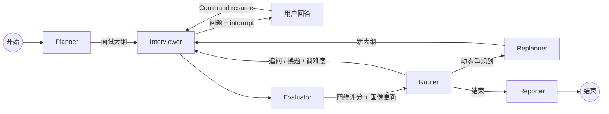

# ⚡️ BaguRush (八股冲刺) v2.1

> **"Because your brain deserves a better way to rot."** 🧠💥

**BaguRush** is an AI-powered multi-Agent Interview System built on **LangGraph**, designed for developers who are tired of soul-crushing interview prep.
Whether it's **Python GIL**, **distributed system design**, or **recommendation algorithms**, BaguRush delivers an adaptive, knowledge-driven mock interview experience.

> **"Bagu" (八股)** — A term used by Chinese developers to describe the repetitive, must-memorize technical trivia for big-tech interviews.

## 🎬 Demo


https://github.com/lulusiyuyu/BaguRush/raw/main/demo-video-2026-03-20.mp4

> 如视频无法加载，请 clone 后查看 `demo-video-2026-03-20.mp4`

---

## ✨ 核心功能

| 功能 | 说明 |
|------|------|
| 📄 **简历驱动出题** | 上传简历自动解析，出题紧贴候选人技术背景 |
| 🤖 **6 Agent 协作** | Planner → Interviewer → Evaluator → Router → Replanner → Reporter 状态图 |
| 🔍 **RAG 知识驱动** | 四级混合检索（FAISS + BM25 + RRF 融合 + BGE Reranker），出题和评估均由知识库驱动 |
| 📊 **四维评估 + 候选人画像** | 完整性 · 准确性 · 深度 · 表达 实时打分，五维度动态候选人画像 |
| 🧠 **自适应面试 + Agent 决策透明化** | LLM 自主路由（追问/换题/调难度/RePlan），前端实时展示 Agent 决策理由和当前难度 |
| 📝 **面试报告** | Markdown 格式完整报告：逐题回顾、强弱项分析、改进建议 |
| 🎨 **LeetCode 风格 UI** | 白灰配色三栏布局，纯 HTML+CSS+JS |
| ⚡ **实时 LLM 数据流** | SSE 推送模型调用、Token 消耗、工具调用全过程 |
| 💾 **会话持久化** | SQLite 持久化 + Token 消耗追踪 |
| 🚀 **GPU 加速** | CUDA 自动检测，Embedding 和 Reranker 均支持 GPU 推理 |

---

## 🏗 系统架构



### Agent 职责

| Agent | 职责 | 使用工具 |
|-------|------|----------|
| **Planner** | 解析简历 + 获取岗位要求 → 制定面试大纲 | `parse_resume`, `search_job_requirements` |
| **Interviewer** | 根据大纲出新题 / 追问 → 进入新话题时**主动检索知识库**，基于检索结果设计更有深度的问题 → `interrupt()` 等待候选人回答 | `search_tech_knowledge` |
| **Evaluator** | 提取候选人回答 → **双重 RAG 检索**（问题 k=4 + 回答 k=2）获取参考 → 多维评估 → 更新候选人画像 → 检测计划外技术提及 | `evaluate_answer`, `search_tech_knowledge` |
| **Router** | LLM 自主决策：6 种路由（追问 / 换题 / 调难度 / 重规划 / 结束），**硬性约束守护**防止无限追问 | 无 |
| **Replanner** | 当候选人提及 plan 外技术时，动态调整剩余面试计划 | 无 |
| **Reporter** | 汇总全部评估 → LLM 生成 Markdown 完整面试报告 | 无 |

### Router 决策透明化（v2.1 新增）

面试过程中，右侧面板实时展示 Agent 的决策过程：

| 展示内容 | 说明 |
|---------|------|
| 🔍 **决策动作** | 追问 / 进入下一话题 / 跳转话题 / 调整难度 / 重新规划 / 结束面试 |
| 📊 **当前难度** | 🟢 简单 / 🟡 中等 / 🔴 困难 |
| 💬 **决策理由** | LLM 的思考过程，如"候选人在分布式锁方面回答深度不足，需要追问" |

---

## 🔍 RAG 知识检索体系

BaguRush 的 RAG 不只是"有就行"的装饰，而是实际驱动出题和评估的核心引擎：

### 四级混合检索 Pipeline

```
用户查询 → FAISS 语义检索 (Top-20)
         → BM25 关键词检索 (Top-20, jieba 分词)
         → RRF 倒数排名融合 (k=60, 去重)
         → BGE Reranker 精排 (Top-k)
         → 最终结果
```

### RAG 在面试中的两个作用层次

| 层次 | 场景 | 实现方式 |
|------|------|----------|
| **出题引导** | Interviewer 进入新话题时**先检索知识库**，基于检索到的知识点设计更有针对性的问题 | Prompt 中要求"必须调用 `search_tech_knowledge`" |
| **追问驱动** | Evaluator 评估回答时，用知识库做**对照评分**，找出候选人遗漏的关键概念，据此生成精准追问建议 | 双重检索 + Prompt 要求"指出候选人未覆盖的知识点" |

> 本质上 RAG 把出题和追问从"LLM 凭感觉"变成了"知识库知识点驱动"。

---

## 🛠 技术栈

| 层级 | 技术 |
|------|------|
| **LLM** | DeepSeek Chat API（`deepseek-chat`），兼容 OpenAI 格式，前端可动态配置 |
| **Agent 编排** | LangGraph 1.0+（StateGraph, interrupt, Command, 条件路由） |
| **持久化** | SqliteSaver（`interviews.db`），失败自动回退 MemorySaver |
| **嵌入** | BAAI/bge-small-zh-v1.5（本地 512 维，支持 CUDA） |
| **向量库** | FAISS（CPU / GPU 自适应） |
| **BM25** | rank_bm25 + jieba 中文分词 |
| **Reranker** | BAAI/bge-reranker-base（FlagEmbedding，支持 CUDA + fp16） |
| **后端** | FastAPI + Uvicorn |
| **前端** | 纯 HTML + CSS + JavaScript + markdown-it |
| **数据模型** | Pydantic v2 |

---

## 🚀 快速启动

### 1. 环境准备

```bash
# Python 3.10+
conda create -n bagurush python=3.11
conda activate bagurush

# 安装依赖
cd bagurush
pip install -r requirements.txt
```

### 2. 配置 API Key

```bash
cp bagurush/.env.example bagurush/.env
# 编辑 .env，填入你的 DeepSeek API Key
# DEEPSEEK_API_KEY=sk-xxxxx
```

### 3. 构建知识库索引

```bash
cd bagurush
python -m rag.vector_store --init
```

### 4. 启动 / 停止服务

> ⚠️ **使用脚本前，请先在当前终端激活 conda 环境**，脚本本身不会自动激活：
> ```bash
> conda activate bagurush
> ```

项目根目录提供了两个便捷脚本：

```bash
# 后台启动（日志写入 server.log）
./start.sh

# 停止服务
./stop.sh
```

**`start.sh`**：使用当前 shell 的 `python` 启动服务，自动检测重复实例和 `.env` 文件，PID 写入 `server.pid`。

**`stop.sh`**：读取 `server.pid` 优雅退出，并 `pkill` 残留进程确保干净停止。

> **手动前台启动（实时看日志）：**
> ```bash
> cd bagurush && python -m uvicorn main:app --host 0.0.0.0 --port 8000
> ```

### 5. 访问

打开浏览器：**http://localhost:8000**

启动后可访问 **http://localhost:8000/docs** 查看 Swagger 交互式 API 文档。

---

## 📖 使用流程

1. **上传简历** — 支持 PDF / Markdown / TXT 格式
2. **选择岗位** — 后端开发 / 推荐系统 / ML 工程师 / AI Agent 开发者
3. **调整参数** — 题目数量（3-10）、每题最大追问次数（1-3）
4. **开始面试** — AI 自动分析简历、制定大纲、基于知识库出题
5. **作答交互** — 输入回答（Ctrl+Enter 提交），右侧实时显示评分、候选人画像和 **Agent 决策理由**
6. **查看报告** — 面试结束后自动生成完整评估报告

---

## 📡 API 端点

| 方法 | 端点 | 说明 |
|------|------|------|
| `POST` | `/api/interview/start` | 上传简历启动面试（multipart/form-data） |
| `POST` | `/api/interview/{session_id}/answer` | 提交候选人回答（返回评估 + Agent 决策 + 难度） |
| `POST` | `/api/interview/{session_id}/end` | 手动结束面试并生成报告 |
| `GET` | `/api/interview/{session_id}/status` | 查询面试状态 |
| `GET` | `/api/interview/{session_id}/report` | 获取面试报告 |
| `GET` | `/api/interview/{session_id}/history` | 获取对话历史 |
| `GET` | `/health` | 健康检查 |

**LLM 动态配置**：前端可通过 HTTP 请求头配置 LLM（`x-llm-api-key` / `x-llm-base-url` / `x-llm-model`），无需重启服务。

---

## 📂 项目结构

```
BaguRush/
├── start.sh                     # 后台启动脚本
├── stop.sh                      # 停止服务脚本
├── demo-video-2026-03-20.mp4    # Demo 演示视频
│
├── bagurush/                    # 项目主目录
│   ├── main.py                  # FastAPI 入口（含 no-cache 中间件）
│   ├── requirements.txt         # Python 依赖
│   │
│   ├── agents/                  # Agent 节点（6 个）
│   │   ├── state.py             # InterviewState（25+ 字段，含 router_reason）
│   │   ├── planner.py           # Planner — 简历分析 + 面试规划
│   │   ├── interviewer.py       # Interviewer — RAG 驱动出题 + interrupt
│   │   ├── evaluator.py         # Evaluator — 双重 RAG 检索 + 四维评估 + 画像更新
│   │   ├── router.py            # Router — LLM 自主 6 路由决策 + 硬性约束守护
│   │   ├── replanner.py         # Replanner — 动态重规划
│   │   ├── reporter.py          # Reporter — Markdown 报告生成
│   │   └── graph.py             # LangGraph 状态图组装（SqliteSaver 持久化）
│   │
│   ├── tools/                   # LangChain @tool（5 个）
│   │   ├── resume_parser.py     # 简历解析（PDF/MD → JSON + session 向量索引）
│   │   ├── job_search.py        # 岗位要求检索
│   │   ├── knowledge_rag.py     # 技术知识 RAG（HybridRetriever）
│   │   ├── answer_evaluator.py  # 多维评估（四维评分 + profile_update + new_mention）
│   │   └── code_analyzer.py     # 代码质量分析
│   │
│   ├── rag/                     # RAG 检索系统
│   │   ├── embeddings.py        # BGE 嵌入模型（CUDA 自动检测）
│   │   ├── document_loader.py   # 文档加载 + 智能切分（二次切分 + 重叠窗口）
│   │   ├── vector_store.py      # FAISS 向量存储（全局 + session 级）
│   │   └── hybrid_retriever.py  # 四级混合检索（FAISS + BM25 + RRF + Reranker）
│   │
│   ├── prompts/                 # Prompt 模板
│   │   ├── planner_prompt.py
│   │   ├── interviewer_prompt.py  # 含 RAG 强制调用指引
│   │   ├── evaluator_prompt.py    # 含追问建议原则（参考资料对照）
│   │   └── reporter_prompt.py
│   │
│   ├── api/                     # API 路由层
│   │   ├── routes.py            # FastAPI 端点（含 Agent 决策字段下发）
│   │   └── schemas.py           # Pydantic Response/Request 模型
│   │
│   ├── utils/                   # 工具模块
│   │   ├── llm_config.py        # LLM 配置（DeepSeek，支持运行时动态切换）
│   │   ├── llm_events.py        # SSE 事件流 + Token 追踪
│   │   └── token_tracker.py     # Token 消耗追踪
│   │
│   ├── knowledge_base/          # 预置知识库
│   │   ├── tech/                # 技术文档（Python / 数据结构 / 系统设计 / ML / 推荐系统）
│   │   └── jobs/                # 岗位要求 JSON（4 个岗位）
│   │
│   ├── frontend/                # 前端 UI
│   │   ├── index.html           # 页面结构（含 Agent 决策卡片）
│   │   ├── style.css            # LeetCode 风格样式（含决策卡片样式）
│   │   ├── app.js               # 交互逻辑（SSE + Agent 决策渲染）
│   │   └── markdown-it.min.js   # Markdown 渲染库
│   │
│   └── tests/                   # 测试（8 个文件，112 用例）
│       ├── test_agents.py       # Agent 节点 + Prompt 验证（38 用例）
│       ├── test_tools.py        # 工具函数测试（22 用例）
│       ├── test_graph.py        # 图结构 + API 端点（16 用例）
│       ├── test_replanner.py    # 动态重规划（14 用例）
│       ├── test_hybrid_retriever.py  # 混合检索（10 用例）
│       ├── test_token_tracker.py     # Token 追踪（7 用例）
│       ├── test_graph_checkpointer.py  # 持久化（2 用例）
│       └── test_full_flow.py    # 端到端集成测试（5 用例）
│
└── ProjectContext/              # 项目文档
    ├── README_v1.0.md           # v1.0 版本 README 存档
    ├── README_v2.0.md           # v2.0 版本 README 存档
    ├── Delivery_v2.0.md         # v2.0 交付文档 + 教学指南
    ├── RAG_Upgrade_Plan.md      # RAG 使用效果提升方案
    ├── RAG_Chunking_Optimization.md  # RAG 分块优化实施记录
    └── Frontend_Enhancement_TodoList.md  # 前端增强任务清单
```

---

## 🧪 测试

```bash
cd bagurush

# 运行全量测试（约 2-3 分钟）
python -m pytest tests/ -v --tb=short

# 仅运行 Agent 相关测试
python -m pytest tests/test_agents.py -v

# 仅运行 RAG 相关测试
python -m pytest tests/test_hybrid_retriever.py tests/test_agents.py::TestInterviewerPromptRAG tests/test_agents.py::TestEvaluatorRAGEnhancement tests/test_agents.py::TestEvaluatorPromptRAG -v
```

当前测试覆盖：**110 passed, 2 skipped**（8 个测试文件，跨 Agent / Tools / RAG / Graph / API）。

---

## 📋 版本历史

| 版本 | 日期 | 主要更新 |
|------|------|---------|
| **v2.1** | 2026-03-20 | Router 决策透明化（前端展示 Agent 决策/难度/理由）、修复无限追问 Bug、RAG 分块优化、头像修复 |
| **v2.0** | 2026-03-18 | 6 Agent 架构、四级混合 RAG、候选人画像、SQLite 持久化、SSE 数据流、手动结束面试 |
| **v1.0** | 2026-03-16 | 基础面试系统、Planner/Interviewer/Evaluator/Reporter 四节点 |

---

## 🔮 Roadmap

- [ ] 支持更多简历格式（DOCX, HTML）
- [ ] 编程题在线编辑器（Monaco Editor）
- [ ] 多语言支持（英文面试）
- [ ] 语音面试模式（ASR + TTS）
- [ ] Docker 一键部署
- [ ] 面试数据分析看板

---

## 📄 License

MIT

---

*Built with ❤️ by the BaguRush Team — Powered by LangGraph & DeepSeek*
