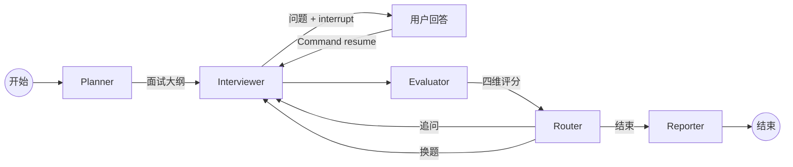

# ⚡️ BaguRush (八股冲刺)

> **"Because your brain deserves a better way to rot."** 🧠💥

**BaguRush** is an AI-powered Interview Agent designed for developers who are tired of soul-crushing interview prep.
Whether it's **Frontend closures**, **Backend distributed locks**, or **System Design patterns**, we turn the "Technical Brain Rot" (aka *Bagu* / 八股文) into a high-speed, interactive vibe.

> **"Bagu" (八股)** — A term used by Chinese developers to describe the repetitive, must-memorize technical trivia for big-tech interviews.

---

## ✨ 核心功能

| 功能 | 说明 |
|------|------|
| 📄 **简历驱动** | 上传简历自动解析，出题紧贴候选人背景 |
| 🤖 **多 Agent 协作** | Planner → Interviewer → Evaluator → Router → Reporter 五节点状态图 |
| 📊 **四维评估** | 完整性 · 准确性 · 深度 · 表达 实时打分 |
| 🔁 **智能追问** | 低分自动追问，高分切换话题 |
| 📝 **面试报告** | Markdown 格式完整报告：逐题回顾、强弱项分析、改进建议 |
| 🎨 **LeetCode 风格 UI** | 白灰配色三栏布局，纯 HTML+CSS+JS |
| ⚡ **实时 LLM 数据流** | 终端风格实时展示模型调用、Token 流、工具调用 |

---

## 🏗 系统架构



### Agent 职责

| Agent | 职责 | 使用工具 |
|-------|------|----------|
| **Planner** | 解析简历 + 获取岗位要求 → 制定面试大纲 | `parse_resume`, `search_job_requirements` |
| **Interviewer** | 根据大纲生成技术问题 / 追问 → `interrupt()` 等待回答 | `search_tech_knowledge` |
| **Evaluator** | 提取用户回答 → RAG 获取参考 → 多维评估 | `evaluate_answer`, `search_tech_knowledge` |
| **Router** | 纯逻辑判断：追问 / 换题 / 结束 | 无 |
| **Reporter** | 汇总评估 → LLM 生成 Markdown 报告 | 无 |

---

## 🛠 技术栈

| 层级 | 技术 |
|------|------|
| LLM | DeepSeek Chat API (`deepseek-chat`) |
| 编排 | LangGraph 1.0+ (StateGraph, interrupt, Command, MemorySaver) |
| 嵌入 | BAAI/bge-small-zh-v1.5（本地 512 维） |
| 向量库 | FAISS（CPU） |
| 后端 | FastAPI + Uvicorn |
| 前端 | 纯 HTML + CSS + JavaScript + markdown-it |
| 数据模型 | Pydantic v2 |

---

## 🚀 快速启动

### 1. 环境准备

```bash
# Python 3.10+
conda create -n bagurush python=3.13
conda activate bagurush

# 安装依赖
cd bagurush
pip install -r requirements.txt
```

### 2. 配置 API Key

```bash
cp bagurush/.env.example bagurush/.env
# 编辑 bagurush/.env，填入你的 DeepSeek API Key
# DEEPSEEK_API_KEY=sk-xxxxx
```

### 3. 构建知识库索引

```bash
cd bagurush
python -m rag.vector_store --init
```

### 4. 启动 / 停止服务（推荐）

项目根目录提供了两个便捷脚本：

```bash
# 后台启动（日志写入 server.log，关闭终端后仍保持运行）
./start.sh

# 停止服务
./stop.sh
```

**`start.sh` 说明：**
- 自动检测是否已有实例在运行，避免重复启动
- 检查 `bagurush/.env` 是否存在，缺失时给出提示
- 服务以后台方式运行，PID 写入 `server.pid`，日志写入 `server.log`

**`stop.sh` 说明：**
- 读取 `server.pid` 定位进程并优雅退出
- 若 PID 文件不存在，则按进程名兜底查找并终止

> **手动启动（前台，可实时看日志）：**
> ```bash
> cd bagurush
> python -m uvicorn main:app --host 0.0.0.0 --port 8000
> ```

### 5. 访问

打开浏览器访问：**http://localhost:8000**

---

## 📖 使用流程

1. **上传简历** — 支持 PDF / Markdown / TXT 格式
2. **选择岗位** — 后端开发 / 推荐系统 / ML 工程师 / AI Agent 开发者
3. **调整参数** — 题目数量（3-10）、每题最大追问次数（1-3）
4. **开始面试** — AI 自动分析简历、制定大纲、开始提问
5. **作答交互** — 输入回答（Ctrl+Enter 提交），右侧实时显示评分
6. **查看报告** — 面试结束后自动生成完整评估报告

---

## 📡 API 文档

| 方法 | 端点 | 说明 |
|------|------|------|
| `POST` | `/api/interview/start` | 上传简历启动面试（multipart/form-data） |
| `POST` | `/api/interview/{session_id}/answer` | 提交回答（JSON） |
| `GET` | `/api/interview/{session_id}/status` | 查询面试状态 |
| `GET` | `/api/interview/{session_id}/report` | 获取面试报告 |
| `GET` | `/api/interview/{session_id}/history` | 获取对话历史 |
| `GET` | `/health` | 健康检查 |

启动后可访问 **http://localhost:8000/docs** 查看 Swagger 交互式文档。

---

## 📂 项目结构

```
bagurush/
├── agents/                  # Agent 节点定义
│   ├── state.py             # InterviewState 类型定义
│   ├── planner.py           # Planner Agent（面试规划）
│   ├── interviewer.py       # Interviewer Agent（提问 + interrupt）
│   ├── evaluator.py         # Evaluator Agent（多维评估）
│   ├── router.py            # Router 节点（路由逻辑）
│   ├── reporter.py          # Reporter Agent（报告生成）
│   └── graph.py             # LangGraph 状态图组装
├── api/                     # FastAPI 路由
│   ├── schemas.py           # Pydantic 请求/响应模型
│   └── routes.py            # 5 个 API 端点
├── tools/                   # @tool 工具函数
│   ├── resume_parser.py     # 简历解析（PDF/MD → JSON）
│   ├── job_search.py        # 岗位要求检索
│   ├── knowledge_rag.py     # 技术知识 RAG 检索
│   ├── answer_evaluator.py  # 回答多维评估
│   └── code_analyzer.py     # 代码质量分析
├── rag/                     # RAG 知识库管理
│   ├── embeddings.py        # BGE 嵌入模型封装
│   ├── document_loader.py   # 文档加载 + 切分
│   └── vector_store.py      # FAISS 向量存储
├── prompts/                 # Prompt 模板
│   ├── planner_prompt.py
│   ├── interviewer_prompt.py
│   ├── evaluator_prompt.py
│   └── reporter_prompt.py
├── knowledge_base/          # 预置知识库
│   ├── tech/                # 技术文档（Python/DS/系统设计/ML/推荐系统）
│   └── jobs/                # 岗位要求 JSON
├── frontend/                # 前端 UI
│   ├── index.html           # 页面结构
│   ├── style.css            # LeetCode 风格样式
│   ├── app.js               # 交互逻辑
│   └── markdown-it.min.js   # Markdown 渲染库
├── tests/                   # 测试
│   ├── test_tools.py        # 工具函数测试（22 用例）
│   ├── test_agents.py       # Agent 单元测试（30 用例）
│   ├── test_graph.py        # 图结构 + API 端点测试（15 用例）
│   └── test_full_flow.py    # 完整流程集成测试
├── main.py                  # FastAPI 入口
├── requirements.txt         # Python 依赖
└── .env                     # 环境变量（API Key）
```

---

## 🧪 测试

```bash
# 运行所有静态测试（不调用 LLM，秒级完成）
pytest tests/ -v -m "not llm"

# 运行全部测试（含 LLM 调用，需要 API Key，约 2-5 分钟）
pytest tests/ -v

# 仅运行工具测试
pytest tests/test_tools.py -v -m "not llm"
```

当前测试覆盖：**63 个静态测试** 全部通过 + **10 个 LLM 集成测试**。

---

## 🔮 Roadmap

- [ ] 支持更多简历格式（DOCX, HTML）
- [ ] 编程题在线编辑器（Monaco Editor）
- [ ] 面试历史记录持久化（SQLite/PostgreSQL）
- [ ] 多语言支持（英文面试）
- [ ] 语音面试模式（ASR + TTS）
- [ ] Docker 一键部署
- [ ] 面试数据分析看板

---

## 📄 License

MIT

---

*Built with ❤️ by the BaguRush Team — Powered by LangGraph & DeepSeek*
